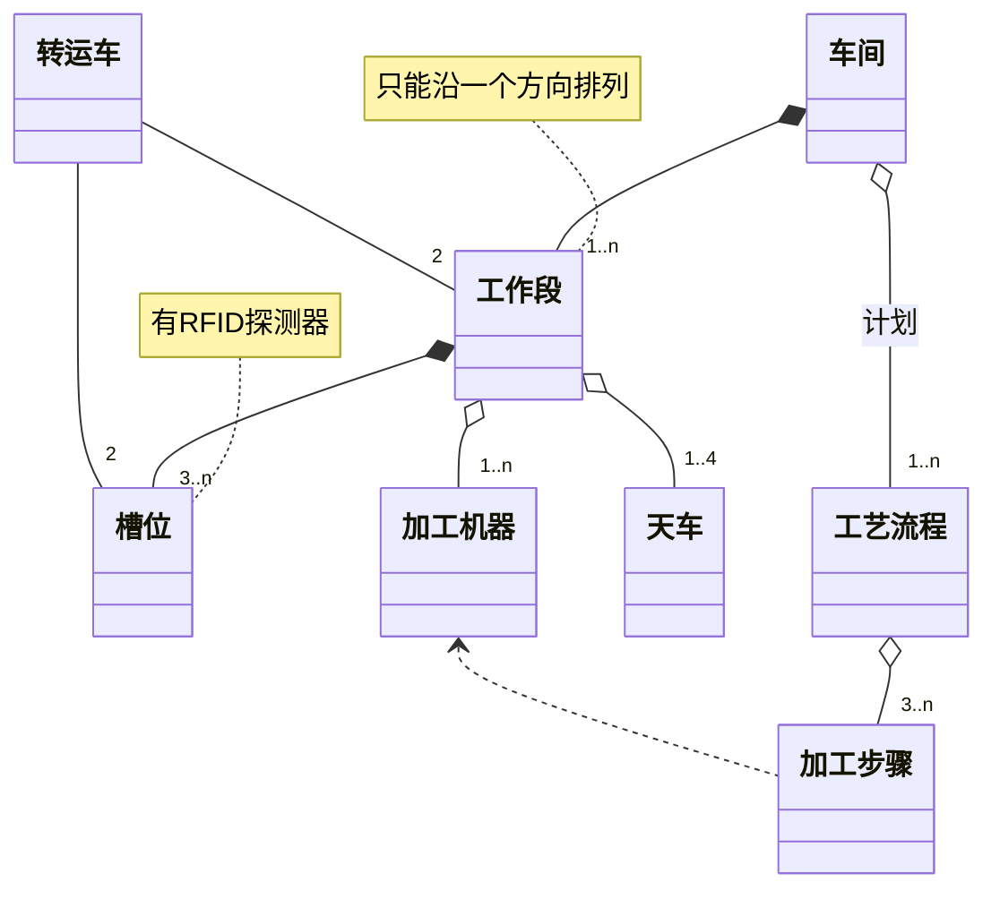

```mermaid
classDiagram
  车间 *-- "1..n" 工作段
  工作段 *-- "3..n" 槽位
  工作段 o-- "1..n" 加工机器
  工作段 o-- "1..4" 天车
  转运车 -- "2" 工作段
  转运车 -- "2" 槽位

  车间 o-- "1..n" 工艺流程 : 计划
  工艺流程 o-- "3..n" 加工步骤
  加工机器  <.. 加工步骤

  note for 槽位 "有RFID探测器"
  note for 工作段 "只能沿一个方向排列"
```
