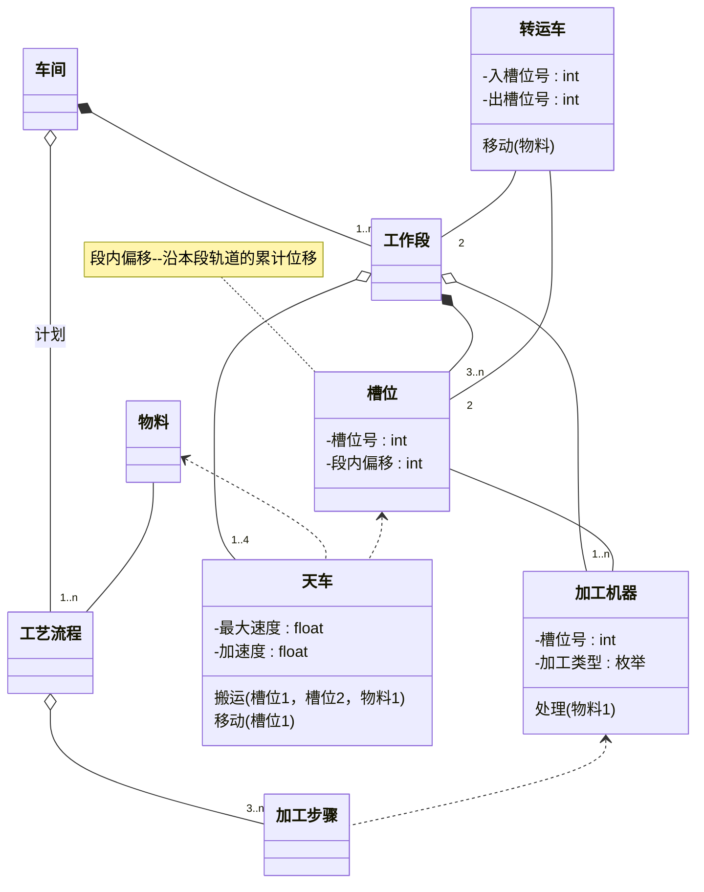

```mermaid
classDiagram
  车间 *-- "1..n" 工作段
  工作段 *-- "3..n" 槽位
  工作段 o-- "1..n" 加工机器
  工作段 o-- "1..4" 天车
  转运车 -- "2" 工作段
  转运车 -- "2" 槽位

  车间 o-- "1..n" 工艺流程 : 计划
  工艺流程 o-- "3..n" 加工步骤
  加工机器  <.. 加工步骤

  物料 -- 工艺流程
  物料  <.. 天车
  槽位  <.. 天车
  槽位  -- 加工机器

  class 转运车 {
      -入槽位号 : int
      -出槽位号 : int
      移动(物料)
  }
  class 槽位 {
      -槽位号 : int
      -段内偏移 : int
  }
  note for 槽位 "段内偏移--沿本段轨道的累计位移"
  class 加工机器 {
      -槽位号 : int
      -加工类型 : 枚举
      处理(物料1)
  }

  class 天车 {
      -最大速度 : float
      -加速度 : float
      搬运(槽位1，槽位2，物料1)
      移动(槽位1)
  }

```