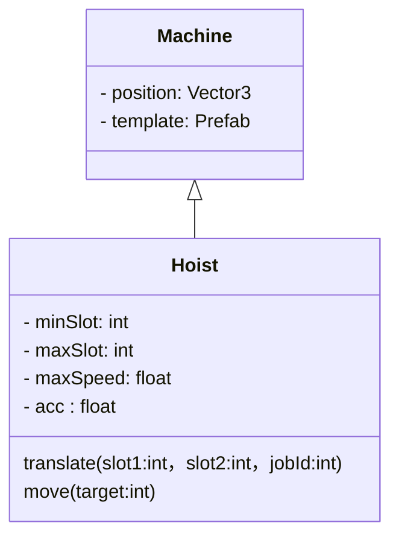

```mermaid
classDiagram
  class Machine {
      - position: Vector3
      - template: Prefab
  }
  class Hoist {
      - minSlot: int
      - maxSlot: int
      - maxSpeed: float
      - acc : float
      translate(slot1:int，slot2:int，jobId:int)
      move(target:int)
  }
  Machine  <|-- Hoist
```